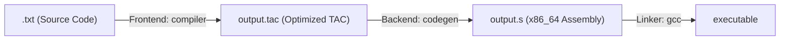

# Modular Compiler (GCC/LLVM-style Pipeline)

This project implements a complete compiler for a simple imperative programming language (supporting `int` and `float` types, `if/else` conditional structures, `while` loops, functions, as well as `print` and `read` commands).

The compiler's architecture was recently refactored to completely separate the **Frontend** from the **Backend**, adopting a modular pipeline with a typed, self-contained, and optimized **Three-Address Code (TAC)** intermediate representation.

---

## Pipeline Architecture



1. **Frontend (`compiler`)**: Developed using Flex/Bison (`lexer.l` and `parser.y`). It performs lexical, syntactic, and semantic analyses (type checking and scopes). Then, it generates the TAC in memory, applies local optimizations, and writes to the self-contained `output.tac` file.
2. **Backend (`codegen`)**: An independent program in pure C (`backend.c`). It reads `output.tac` line by line, performs linear mapping of local variables on the stack frame (`-8(%rbp)`, `-16(%rbp)`, etc.), and translates the instructions linearly to x86_64 Assembly (`output.s`).
3. **Linker/Assembler (`gcc`)**: Compiles the final Assembly code, linking with the C standard library (`libc`) to resolve `printf` and `scanf` calls.

---

## Optimization Module (in Frontend)

Before saving the `output.tac` file, the frontend runs two optimization passes in memory:

*   **Constant Folding**: Binary operations involving only constant/literal values are pre-calculated at compile-time.
    *   *Example:* `t1 = 2 + 3` becomes directly `t1 = 5`.
*   **Algebraic Simplification**: Removal of mathematical redundancies based on algebraic identities.
    *   `x + 0` or `0 + x` $\rightarrow$ `x`
    *   `x - 0` $\rightarrow$ `x`
    *   `x * 1` or `1 * x` $\rightarrow$ `x`
    *   `x * 0` or `0 * x` $\rightarrow$ `0` (or `0.00` for floats)
    *   `x / 1` $\rightarrow$ `x`

---

## Intermediate Representation (TAC)

The generated `output.tac` file is typed and self-contained, using structured directives to guide the codegen backend:
*   `func <name> <return_type> params: <param_type> <param_name>, ...`: Demarcates the beginning and the signature of a function.
*   `endfunc`: Demarcates the end of the function so the backend can close the stack frame (emit the epilogue).
*   `print_int`, `print_float`, `read_int`, `read_float`: Typed I/O instructions.
*   Operators with the `f` suffix (e.g., `+f`, `-f`, `*f`, `/f`, `<f`, `>f`, etc.): Denote floating-point operations.
*   `t1 = (float) x`: Explicit type casting from integer to float.

---

## Prerequisites

To build and run this project, you will need a Unix-like environment (or Windows with WSL) with the following tools installed:
*   `bison` (parser generator)
*   `flex` (lexical analyzer generator)
*   `gcc` (C compiler / Linker)
*   `make` (build automation tool)

---

## How to Run

The project includes a `Makefile` configured to compile both stages and execute the complete pipeline automatically.

### Compile All
Generates the frontend (`compiler`) and backend (`codegen`) executables:
```bash
make all
```

### Run the Pipeline & Link
Compiles the test source code (`test.txt`), runs the codegen backend to generate `output.s`, and builds the native binary `executable`:
```bash
make run
```

### Run the Final Program
Executes the compiled binary:
```bash
make exec
```

### Clean Up Build Files
Removes all binaries and generated intermediate files (`.tac`, `.s`, etc.):
```bash
make clean
```

---

## 📁 File Structure

*   [`lexer.l`](file:///c:/Users/tobia/OneDrive/Área de Trabalho/compiler/lexer.l): Token definitions and lexical analysis (Flex).
*   [`parser.y`](file:///c:/Users/tobia/OneDrive/Área de Trabalho/compiler/parser.y): Grammar rules, syntactic/semantic analysis, AST representation, and optimized TAC generation in memory (Bison).
*   [`backend.c`](file:///c:/Users/tobia/OneDrive/Área de Trabalho/compiler/backend.c): Linear translator from TAC to 64-bit x86_64 Assembly instructions.
*   [`Makefile`](file:///c:/Users/tobia/OneDrive/Área de Trabalho/compiler/Makefile): Build pipeline automation.
*   [`test.txt`](file:///c:/Users/tobia/OneDrive/Área de Trabalho/compiler/test.txt): Test source code written in the compiler's language (checks primalidity of integers).
*   `output.tac`: Intermediate TAC file generated by the frontend.
*   `output.s`: Assembly file generated by the backend.
